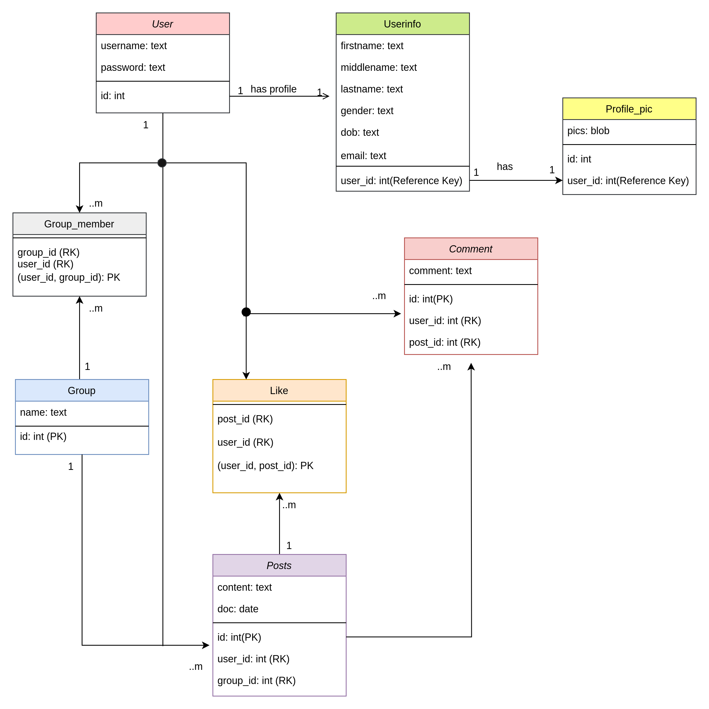

# Group-Chat

This DBMS project involves creating a web application for group chat. The application enables users to create groups, join groups, and post messages within the groups.

### Steps to Set Up and Run the Application

1. **Clone the Repository:**
   ```bash
   git clone https://github.com/realsanjeev/Group-Chat.git group-chat
   cd group-chat
   ```

2. **Create a Virtual Environment and Install Requirements (for Mac/Linux):**
   ```bash
   python3 -m venv venv
   source venv/bin/activate
   pip install -r requirements.txt
   ```

3. **Run the Application:**
   ```bash
   python app.py
   ```

The app will open on the default port of the Flask application at [http://localhost:5000](http://localhost:5000).

## Class Diagram of Database


User -> `admin` and Password -> `admin123`
## Automatically Generating Documentation

To automate the process of generating documentation, follow these steps:

1. Install Sphinx using pip:

   ```bash
   pip install Sphinx
   ```

2. Initialize Sphinx in your project directory:

   ```bash
   sphinx-quickstart
   ```

3. In the `config.py` file generated by Sphinx, add the following lines to ensure that your project's modules are properly imported:

   ```python
   import os
   import sys
   sys.path.insert(0, os.path.abspath('..'))
   ```

4. Use `sphinx-apidoc` to automatically generate documentation for your Python modules. This command should be run in the same directory as your Python files:

   ```bash
   sphinx-apidoc -o docs .
   ```

   This will create `.rst` files in the `docs` directory.

5. Finally, generate the HTML documentation by running:

   ```bash
   make html
   ```

   The generated HTML files can be found in the `docs/_build/html` directory.

These steps automate the process of generating documentation for your Python project using Sphinx.
## Contributing

Contributions are welcome! If you find any issues or want to add new features, feel free to submit a pull request.

## Contact Me

<table>
  <tr>
    <td></td>
    <td></td>
    <td></td>
    <td></td>
  </tr>
</table>